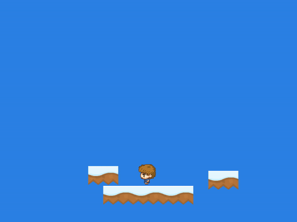

<h2 align=center>Week 8</h2>

<h1 align=center>Exercise: <em>Entity Types</em></h1>

<h3 align=center>3 Red Wolf Moon, Imperial Year MMXXIII</h3>

### Instructions

A classic staple of video games is the collapsing platform, wherein the platform that they player is stepping on suddenly collapses or disappears:


<sub>**Figure 1**: A platform collapsing on Mario as soon as they step on it.</sub>

Let's make a simplified simulation of this behaviour. Using the enum [**`EntityType`**](SDLProject/Entity.h) and the `Entity` class's `m_is_active` and `m_type` attributes, write code that will make a random platform disappear when our player steps on it:



<sub>**Figure 1**: Desired behaviour.</sub>

Note that you'll have to copy the code from not just [**`main.cpp`**](SDLProject/main.cpp), but also [**`Entity.h`**](SDLProject/Entity.h) and [**`Entity.cpp`**](SDLProject/Entity.cpp) to be in the same starting point as me. Also, in order to generate a random integer from 0 to `limit` in C++, one needs to do the following:

```cpp
#include <cstdlib>

int main()
{
    int limit = 100;
    int random_int = rand() % limit;

    return 0;
}
```

Be sure to:

1. Create an entity type that represents the trap (`Entity.h`)
2. Assign that new type to a random platform tile (`main.cpp`)
3. Make sure that if a player-type entity makes a vertical collision with a trap-type platform, to make that platform disappear and not register a collision (`Entity.cpp`)