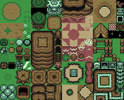
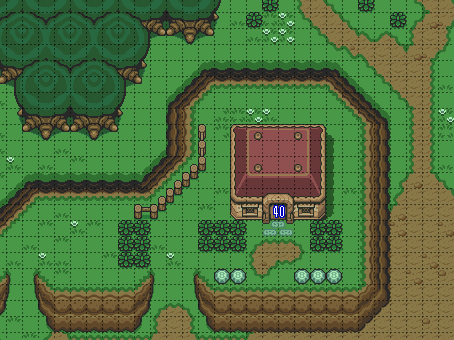
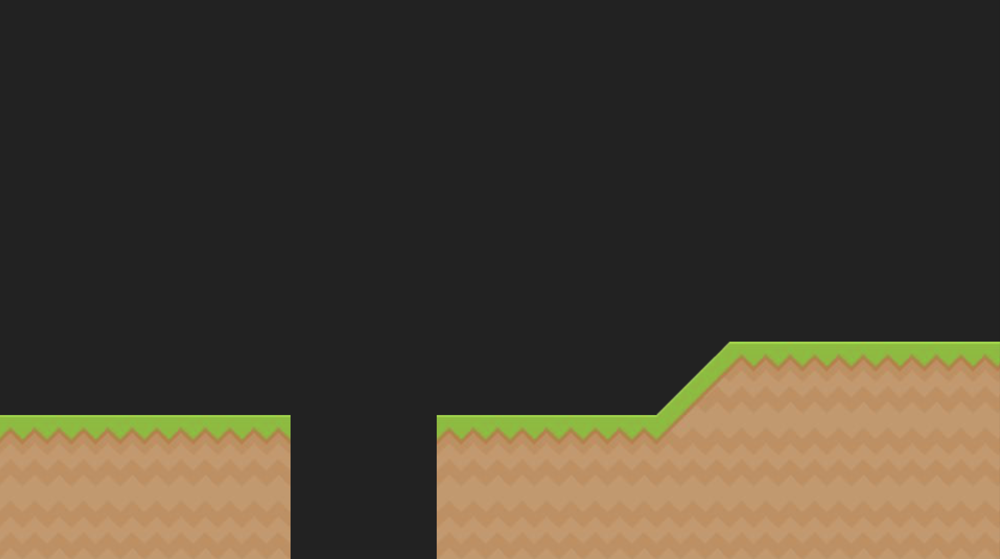
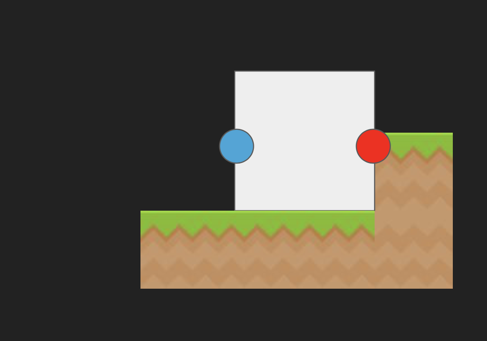

<h1 align=center>Week 08</h1>

<h2 align=center>Tilesets and Tile Maps</h2>


<h3 align=center>14 Lone Moon, Imperial Year MMXXV</h3>

<p align=center><strong><em>Song of the day</strong>: <a href="https://www.youtube.com/watch?v=phT2MJAn1KY&ab_channel=TOMORROWXTOGETHER-Topic"><strong><u>Thursday's Child Has Far To Go</u></strong></a> by TXT (2022).</em></p>

---

### Sections

1. [**Optimising Our Platforms**](#1)
2. [**The `Map` Class**](#2)
3. [**Platforming**](#3)
4. [**Having The Camera Follow The Player**](#4)

---

<a id="1"></a>

### Part 1: **Optimising Our Platforms**

We've been, throughout the semester, constantly optiminsing on the structures that we introduce. The `Entity` class, spritesheets, etc. are all data structures that help abstract away a lot of the work that repeats in game design patterns. So what is next in our optimisations? So far, our map building scheme looks a bit inefficient. For example, to build a simple platformer map, we did the following a couple of lectures ago:

```c++
// ––––– PLATFORMS ––––– //
 g_game_state.platforms = new Entity[PLATFORM_COUNT];
    GLuint platform_texture_id = load_texture(PLATFORM_FILEPATH);
    for(int i = 0; i < PLATFORM_COUNT; i++){
        g_game_state.platforms[i] = Entity(platform_texture_id,0.0f, 0.4f, 0.8f);
    }
    
    g_game_state.platforms[PLATFORM_COUNT - 1].set_position(glm::vec3(-1.5f, -2.35f, 0.0f));
    g_game_state.platforms[PLATFORM_COUNT - 1].update(0.0f, NULL, 0);
    
    for (int i = 0; i < PLATFORM_COUNT - 2; i++)
    {
        g_game_state.platforms[i].set_position(glm::vec3(i - 1.0f, -2.35f, 0.0f));
        g_game_state.platforms[i].update(0.0f, NULL, 0);
    }
    
    g_game_state.platforms[PLATFORM_COUNT - 2].set_position(glm::vec3(2.5f, -2.5f, 0.0f));
    g_game_state.platforms[PLATFORM_COUNT - 2].update(0.0f, NULL, 0);
    
```

<sub>**Code Block 1**: Not exactly modular.</sub>

So how do we fix this? The answer is the analogue of the spritesheet: the tilesheet.




<sub>**Figures 1 and 2**: A tilemap built from a tileset.</sub>

Here, figure 2 is built from repeating patters of tiles from figure 1. The way we do this is by assigning each tile a number, and then telling the program which number we would like rendered onto the screen at a specific location. So, for instance, if our tileset looks like this:


We could potentially build a world like this one:



By doing the following:


Then, we can "draw" the map by assigning a specific index from the tilesheet to a location in the map using an array of indices:

```c++
 unsigned int LEVEL_DATA[] =
{
   0, 0, 0, 0, 0, 0, 0, 0, 0, 0, 0, 0, 0, 0,
   0, 0, 0, 0, 0, 0, 0, 0, 0, 0, 0, 0, 0, 0,
   0, 0, 0, 0, 0, 0, 0, 0, 0, 0, 0, 0, 0, 0,
   0, 0, 0, 0, 0, 0, 0, 0, 0, 0, 0, 0, 0, 0,
   0, 0, 0, 0, 0, 0, 0, 0, 0, 4, 1, 1, 1, 1,
   1, 1, 1, 1, 0, 0, 1, 1, 1, 3, 2, 2, 2, 2,
   2, 2, 2, 2, 0, 0, 2, 2, 2, 2, 2, 2, 2, 2
};
```

<sub>**Code Block 2**: A numerical "drawing" of our stage.</sub>

The result, superimposed with the indices above, looks like this:


<sub>**Figure 3**: Representing a scene using specific tiles from a tilesheet.</sub>

This actually works in a very similar way to how we build and render text—it's simply evenly spaced sprite rendering with images of platforms instead of images of characters.

<br>
<a id="2"></a>

### Part 2: _The `Map` Class_

For this, we will create a new class, `Map`, that will help us do this:

```c++
// Map.h
#pragma once
#define GL_SILENCE_DEPRECATION
#ifdef _WINDOWS
#include <GL/glew.h>
#endif
#define GL_GLEXT_PROTOTYPES 1
#include <vector>
#include <math.h>
#include <SDL.h>
#include <SDL_opengl.h>
#include <SDL_image.h>
#include "glm/mat4x4.hpp"
#include "glm/gtc/matrix_transform.hpp"
#include "ShaderProgram.h"

class Map {
private:
    int m_width;
    int m_height;
    
    // Here, the level_data is the numerical "drawing" of the map
    unsigned int *m_level_data;
    GLuint m_texture_id;
    
    float m_tile_size;
    int   m_tile_count_x;
    int   m_tile_count_y;
    
    // Just like with rendering text, we're rendering several sprites at once
    // So we need vectors to store their respective vertices and texture coordinates
    std::vector<float> m_vertices;
    std::vector<float> m_texture_coordinates;
    
    // The boundaries of the map
    float m_left_bound, m_right_bound, m_top_bound, m_bottom_bound;
    
public:
    // Constructor
    Map(int width, int height, unsigned int *level_data, GLuint texture_id, float tile_size, int
    tile_count_x, int tile_count_y);
    
    // Methods
    void build();
    void render(ShaderProgram *program);
    bool is_solid(glm::vec3 position, float *penetration_x, float *penetration_y);
    
    // Getters
    int const get_width()  const  { return m_width;  }
    int const get_height() const  { return m_height; }
    
    unsigned int* const get_level_data() const { return m_level_data; }
    GLuint        const get_texture_id() const { return m_texture_id; }
    
    float const get_tile_size()    const { return m_tile_size;    }
    int   const get_tile_count_x() const { return m_tile_count_x; }
    int   const get_tile_count_y() const { return m_tile_count_y; }
    
    std::vector<float> const get_vertices()            const { return m_vertices;             }
    std::vector<float> const get_texture_coordinates() const { return m_texture_coordinates; }
    
    float const get_left_bound()   const { return m_left_bound;   }
    float const get_right_bound()  const { return m_right_bound;  }
    float const get_top_bound()    const { return m_top_bound;    }
    float const get_bottom_bound() const { return m_bottom_bound; }
};
```
```c++
// Map.cpp
#include "Map.h"

Map::Map(int width, int height, unsigned int *level_data, GLuint texture_id, float tile_size, int tile_count_x, int tile_count_y)
{
    m_width = width;
    m_height = height;
    
    m_level_data = level_data;
    m_texture_id = texture_id;
    
    m_tile_size = tile_size;
    m_tile_count_x = tile_count_x;
    m_tile_count_y = tile_count_y;
    
    build();
}

void Map::build()
{
    // Since this is a 2D map, we need a nested for-loop
    for(int y_coord = 0; y_coord < m_height; y_coord++)
    {
        for(int x_coord = 0; x_coord < m_width; x_coord++)
        {
            // Get the current tile
            int tile = m_level_data[y_coord * m_width + x_coord];
            
            // If the tile number is 0 i.e. not solid, skip to the next one
            if (tile == 0) continue;
            
            // Otherwise, calculate its UV-coordinated
            float u_coord = (float) (tile % m_tile_count_x) / (float) m_tile_count_x;
            float v_coord = (float) (tile / m_tile_count_x) / (float) m_tile_count_y;
            
            // And work out their dimensions and posititions
            float tile_width = 1.0f/ (float)  m_tile_count_x;
            float tile_height = 1.0f/ (float) m_tile_count_y;
            
            float x_offset = -(m_tile_size / 2); // From center of tile
            float y_offset =  (m_tile_size / 2); // From center of tile
            
            // So we can store them inside our std::vectors
            m_vertices.insert(m_vertices.end(), {
                x_offset + (m_tile_size * x_coord),  y_offset +  -m_tile_size * y_coord,
                x_offset + (m_tile_size * x_coord),  y_offset + (-m_tile_size * y_coord) - m_tile_size,
                x_offset + (m_tile_size * x_coord) + m_tile_size, y_offset + (-m_tile_size * y_coord) - m_tile_size,
                x_offset + (m_tile_size * x_coord), y_offset + -m_tile_size * y_coord,
                x_offset + (m_tile_size * x_coord) + m_tile_size, y_offset + (-m_tile_size * y_coord) - m_tile_size,
                x_offset + (m_tile_size * x_coord) + m_tile_size, y_offset +  -m_tile_size * y_coord
            });
            
            m_texture_coordinates.insert(m_texture_coordinates.end(), {
                u_coord, v_coord,
                u_coord, v_coord + (tile_height),
                u_coord + tile_width, v_coord + (tile_height),
                u_coord, v_coord,
                u_coord + tile_width, v_coord + (tile_height),
                u_coord + tile_width, v_coord
            });
        }
    }
    
    // The bounds are dependent on the size of the tiles
    m_left_bound   = 0 - (m_tile_size / 2);
    m_right_bound  = (m_tile_size * m_width) - (m_tile_size / 2);
    m_top_bound    = 0 + (m_tile_size / 2);
    m_bottom_bound = -(m_tile_size * m_height) + (m_tile_size / 2);
}

void Map::render(ShaderProgram *program)
{
    glm::mat4 model_matrix = glm::mat4(1.0f);
    program->SetModelMatrix(model_matrix);
    
    glUseProgram(program->programID);
    
    glVertexAttribPointer(program->positionAttribute, 2, GL_FLOAT, false, 0, m_vertices.data());
    glEnableVertexAttribArray(program->positionAttribute);
    glVertexAttribPointer(program->texCoordAttribute, 2, GL_FLOAT, false, 0, m_texture_coordinates.data());
    glEnableVertexAttribArray(program->texCoordAttribute);
    
    glBindTexture(GL_TEXTURE_2D, m_texture_id);
    
    glDrawArrays(GL_TRIANGLES, 0, (int) m_vertices.size() / 2);
    glDisableVertexAttribArray(program->positionAttribute);
    glDisableVertexAttribArray(program->texCoordAttribute);
}

bool Map::is_solid(glm::vec3 position, float *penetration_x, float *penetration_y)
{
    *penetration_x = 0;
    *penetration_y = 0;
    
    if (position.x < m_left_bound || position.x > m_right_bound)  return false;
    if (position.y > m_top_bound  || position.y < m_bottom_bound) return false;
    
    int tile_x = floor((position.x + (m_tile_size / 2))  / m_tile_size);
    int tile_y = -(ceil(position.y - (m_tile_size / 2))) / m_tile_size; // Our array counts up as Y goes down.
    
    if (tile_x < 0 || tile_x >= m_width)  return false;
    if (tile_y < 0 || tile_y >= m_height) return false;
    
    int tile = m_level_data[tile_y * m_width + tile_x];
    if (tile == 0) return false;
    
    float tile_center_x = (tile_x  * m_tile_size);
    float tile_center_y = -(tile_y * m_tile_size);
    
    *penetration_x = (m_tile_size / 2) - fabs(position.x - tile_center_x);
    *penetration_y = (m_tile_size / 2) - fabs(position.y - tile_center_y);
    
    return true;
}
```
```c++
// main.cpp
#define LEVEL1_WIDTH 14
#define LEVEL1_HEIGHT 5

#include "Map.h"

const char MAP_TILESET_FILEPATH[] = "assets/tileset.png",

struct GameState
{
    Entity *player;
    Entity *enemies;
    
    Map *map;
    
    Mix_Music *bgm;
    Mix_Chunk *jump_sfx;
};

unsigned int LEVEL_1_DATA[] =
{
    0, 0, 0, 0, 0, 0, 0, 0, 0, 0, 0, 0, 0, 0,
    0, 0, 0, 0, 0, 0, 0, 0, 0, 0, 0, 0, 0, 0,
    1, 1, 0, 0, 0, 0, 0, 0, 0, 1, 1, 1, 1, 1,
    2, 2, 2, 2, 0, 0, 1, 1, 1, 2, 2, 2, 2, 2,
    2, 2, 2, 2, 0, 0, 2, 2, 2, 2, 2, 2, 2, 2
};

void initialise()
{
    // ————— MAP SET-UP ————— //
    GLuint map_texture_id = load_texture(MAP_TILESET_FILEPATH);
    g_state.map = new Map(LEVEL1_WIDTH, LEVEL1_HEIGHT, LEVEL_1_DATA, map_texture_id, 1.0f, 4, 1);  // Look at this beautiful initialisation. That's literally it
}

void update()
{
    while (delta_time >= FIXED_TIMESTEP)
    {
        g_state.player->update(FIXED_TIMESTEP, g_state.player, NULL, 0, g_state.map);
        delta_time -= FIXED_TIMESTEP;
    }
}

void render()
{
    g_state.map->render(&m_program);
}

void shutdown()
{
    delete state.map;
}
```

<sub>**Code Block 3, 4, and 5**: The `Map` class implemented. Keep in mind that now we have no need for the `state.platforms` array, so you can get rid of all the code that involves it. _This includes the `state.player`'s `update()` method_. We'll be looking at that momentarily.</sub>


<br>
<a id="3"></a>

### Part 3: _Platforming_

Now, we need to update a few more things in order to make this map collidable with our player—or rather, the other way around. To do this, we need to convert our entities' positions to the grid coordinates of the tilemap and check if a tile is actually there. This requires us to overload our collision-checking methods to work for both `Entity` objects and `Map` objects.

These new `check_collision_y()` and `check_collision_x()` methods will be probing for three points and checking whether the tile that we are colliding with is supposed to be solid or not. For instance, in the case of a pit:




<sub>**Figures 4 and 5**: Collision detection in both cardinal coordinates.</sub>

The key method to consider here is **`is_solid()`**:

```c++
// Map.cpp
bool Map::is_solid(glm::vec3 position, float *penetration_x, float *penetration_y)
{
    // The penetration between the map and the object
    // The reason why these are pointers is because we want to reassign values
    // to them in case that we are colliding. That way the object that originally
    // passed them as values will keep track of these distances
    // inb4: we're passing by reference
    *penetration_x = 0;
    *penetration_y = 0;
    
    // If we are out of bounds, it is not solid
    if (position.x < m_left_bound || position.x > m_right_bound)  return false;
    if (position.y > m_top_bound  || position.y < m_bottom_bound) return false;
    
    int tile_x = floor((position.x + (m_tile_size / 2))  / m_tile_size);
    int tile_y = -(ceil(position.y - (m_tile_size / 2))) / m_tile_size; // Our array counts up as Y goes down.
    
    // If the tile index is negative or greater than the dimensions, it is not solid
    if (tile_x < 0 || tile_x >= m_width)  return false;
    if (tile_y < 0 || tile_y >= m_height) return false;
    
    // If the tile index is 0 i.e. an open space, it is not solid
    int tile = m_level_data[tile_y * m_width + tile_x];
    if (tile == 0) return false;
    
    // And we likely have some overlap
    float tile_center_x = (tile_x  * m_tile_size);
    float tile_center_y = -(tile_y * m_tile_size);
    
    // And because we likely have some overlap, we adjust for that
    *penetration_x = (m_tile_size / 2) - fabs(position.x - tile_center_x);
    *penetration_y = (m_tile_size / 2) - fabs(position.y - tile_center_y);
    
    return true;
}
```

<sub>**Code Block 6**: This method serves a double purpose; it both a) tells us whether or not a specific tile is solid, and b) tells the calling scope by how much we've penetrated this given tile (via `penetration_x` and `penetration_y` pointers).</sub>

The `is_solid` method in the `Map` class plays a critical role in determining whether a specific point in the game world corresponds to a solid tile on the map. This is essential for collision detection, which is a cornerstone of platforming mechanics in games. Let's break down the function in a technical and game programming context:

#### Key Aspects of `is_solid`:

1. **Position-Based Collision Detection**:
   The method takes in a 3D vector (`glm::vec3 position`), representing the player's or entity's position in the game world. The primary goal of the function is to check whether the tile at this position is solid, thus determining if a collision should occur. While the game might be 2D, the `glm::vec3` is used because it's common to work with 3D vectors in OpenGL and game development for positioning and transformations, even in 2D games.

2. **Tilemap Coordinates Conversion**:
   The player's `position` is provided in world coordinates (floating-point values for precise location), while the tiles in the map are indexed in an integer-based grid. The function converts these world coordinates to corresponding tile coordinates (`tile_x` and `tile_y`) by dividing the position by the tile size. It also uses a floor and ceil operation to round to the nearest tile on the grid:
   - `tile_x`: Horizontal tile index.
   - `tile_y`: Vertical tile index (noting that Y coordinates typically increase downward in many 2D maps, which is why the `-` sign is used in the formula).

3. **Boundary Checking**:
   Before determining the solidity of the tile, the method checks if the position is outside the boundaries of the map:
   - `m_left_bound`, `m_right_bound`, `m_top_bound`, and `m_bottom_bound` define the edges of the map, calculated based on the size and number of tiles in the map.
   If the player's position is outside these boundaries, the function immediately returns `false`, meaning there is no solid tile in that location (as the player is outside the playable area).

4. **Tile Lookup**:
   If the position is within bounds, the method retrieves the corresponding tile index from the `m_level_data` array:
   ```cpp
   int tile = m_level_data[tile_y * m_width + tile_x];
   ```
   Here, `m_level_data` is a 1D array that represents the tilemap. The array stores integers representing different tiles (such as grass, water, stone, etc.). If the value of the tile at the calculated coordinates is `0`, it means the tile is not solid, and the method returns `false`.

5. **Penetration Calculations**:
   If the tile is solid (non-zero), the function calculates the penetration values in the X and Y directions. Penetration values help resolve collisions by determining how far the player has entered into a solid tile:
   - `penetration_x` and `penetration_y` are passed by reference, allowing the method to modify their values.
   - The penetration is calculated as the difference between the player's position and the center of the tile. If the player is intersecting with the tile, this penetration value helps in pushing the player back to prevent them from going through the tile.

   ```cpp
   *penetration_x = (m_tile_size / 2) - fabs(position.x - tile_center_x);
   *penetration_y = (m_tile_size / 2) - fabs(position.y - tile_center_y);
   ```

6. **Return Value**:
   The function returns `true` if the tile is solid, indicating that a collision has occurred and further action should be taken to resolve the collision (like moving the player back, adjusting the position, etc.). If the tile is non-solid or out of bounds, the method returns `false`.

In platforming games, solid tiles are typically used to represent platforms, walls, or ground where the player can walk or collide. The `is_solid` function is a fundamental part of this because it helps define where a player can move and where they should stop due to obstacles.

By using the `penetration_x` and `penetration_y`, the game can adjust the player’s position after a collision, ensuring the player doesn’t pass through platforms or walls. The game loop would typically call this function multiple times per frame to check if the player is colliding with the map tiles as they move around.

To put this method into context, consider our `Entity` class's current implementations of `check_collision_y()` and `check_collision_x()`

```c++
// Entity.cpp
#include "Map.h"

class Entity
{
private:
    // Now, update should check for both objects in the game AND the map
    void update(float delta_time, Entity *player, Entity *objects, int object_count, Map *map);

    void const check_collision_y(Entity *collidable_entities, int collidable_entity_count);
    void const check_collision_x(Entity *collidable_entities, int collidable_entity_count);

    // Overloading our methods to check for only the map
    void const check_collision_y(Map *map);
    void const check_collision_x(Map *map);
}
```
```c++
// Entity.h
void Entity::update(float delta_time, Entity *player, Entity *objects, int object_count, Map *map)
{
    // We make two calls to our check_collision methods, one for the collidable objects and one for
    // the map.
    m_position.y += m_velocity.y * delta_time;
    check_collision_y(objects, object_count);
    check_collision_y(map);
    
    m_position.x += m_velocity.x * delta_time;
    check_collision_x(objects, object_count);
    check_collision_x(map);
}

void const Entity::check_collision_y(Map *map)
{
    // Probes for tiles above
    glm::vec3 top = glm::vec3(m_position.x, m_position.y + (m_height / 2), m_position.z);
    glm::vec3 top_left = glm::vec3(m_position.x - (m_width / 2), m_position.y + (m_height / 2), m_position.z);
    glm::vec3 top_right = glm::vec3(m_position.x + (m_width / 2), m_position.y + (m_height / 2), m_position.z);
    
    // Probes for tiles below
    glm::vec3 bottom = glm::vec3(m_position.x, m_position.y - (m_height / 2), m_position.z);
    glm::vec3 bottom_left = glm::vec3(m_position.x - (m_width / 2), m_position.y - (m_height / 2), m_position.z);
    glm::vec3 bottom_right = glm::vec3(m_position.x + (m_width / 2), m_position.y - (m_height / 2), m_position.z);
    
    float penetration_x = 0;
    float penetration_y = 0;
    
    // If the map is solid, check the top three points
    if (map->is_solid(top, &penetration_x, &penetration_y) && m_velocity.y > 0)
    {
        m_position.y -= penetration_y;
        m_velocity.y = 0;
        m_collided_top = true;
    }
    else if (map->is_solid(top_left, &penetration_x, &penetration_y) && m_velocity.y > 0)
    {
        m_position.y -= penetration_y;
        m_velocity.y = 0;
        m_collided_top = true;
    }
    else if (map->is_solid(top_right, &penetration_x, &penetration_y) && m_velocity.y > 0)
    {
        m_position.y -= penetration_y;
        m_velocity.y = 0;
        m_collided_top = true;
    }
    
    // And the bottom three points
    if (map->is_solid(bottom, &penetration_x, &penetration_y) && m_velocity.y < 0)
    {
        m_position.y += penetration_y;
        m_velocity.y = 0;
        m_collided_bottom = true;
    }
    else if (map->is_solid(bottom_left, &penetration_x, &penetration_y) && m_velocity.y < 0)
    {
            m_position.y += penetration_y;
            m_velocity.y = 0;
            m_collided_bottom = true;
    }
    else if (map->is_solid(bottom_right, &penetration_x, &penetration_y) && m_velocity.y < 0)
    {
        m_position.y += penetration_y;
        m_velocity.y = 0;
        m_collided_bottom = true;
        
    }
}

void const Entity::check_collision_x(Map *map)
{
    // Probes for tiles; the x-checking is much simpler
    glm::vec3 left  = glm::vec3(m_position.x - (m_width / 2), m_position.y, m_position.z);
    glm::vec3 right = glm::vec3(m_position.x + (m_width / 2), m_position.y, m_position.z);
    
    float penetration_x = 0;
    float penetration_y = 0;
    
    if (map->is_solid(left, &penetration_x, &penetration_y) && m_velocity.x < 0)
    {
        m_position.x += penetration_x;
        m_velocity.x = 0;
        m_collided_left = true;
    }
    if (map->is_solid(right, &penetration_x, &penetration_y) && m_velocity.x > 0)
    {
        m_position.x -= penetration_x;
        m_velocity.x = 0;
        m_collided_right = true;
    }
}
```

<sub>**Code Blocks 7 and 8**: Collisions with the map and collisions with other entities are inherently different—for the better.</sub>

<br>
<a id="4"></a>

### Part 4: _Having The Camera Follow The Player_

One last quick thing we can talk about is how we can get the camera to follow the player. How do we do that? Well, in order to perform transformations on an object, we know that we have to modify it's model matrix. This makes sense—model is the word we use for physical objects that are supposed to represent physical things.

But what about the camera—something that is supposed to reprresent the things that we can _see_? Do we have a matrix that takes care of that? Of course we do—the **view matrix**. And the transformations required to achieve a following camera is super, super simple:

```c++
// main.cpp
void update()
{
    // STEP 1: Just like with our model matrices, we reset our view matrix to the identity matrix at the beginning of every frame and...
    g_view_matrix = glm::mat4(1.0f);

    // STEP 2: ...translate it to the NEGATIVE x-position of whatever you want the camera to follow
    g_view_matrix = glm::translate(g_view_matrix, glm::vec3(-g_game_state.player->get_position().x, 0.0f, 0.0f));
}
```

<sub>**Code Block 9**: Picture [**Lakitu**](https://www.mariowiki.com/Lakitu_Bros.) following you around with this camera.</sub>