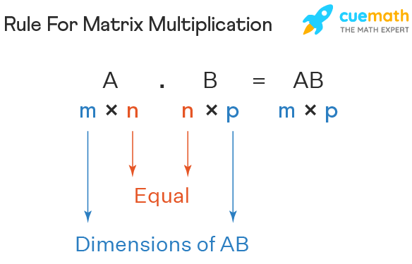
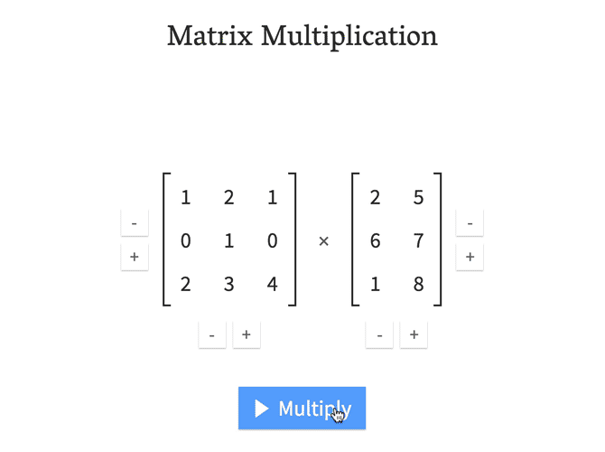
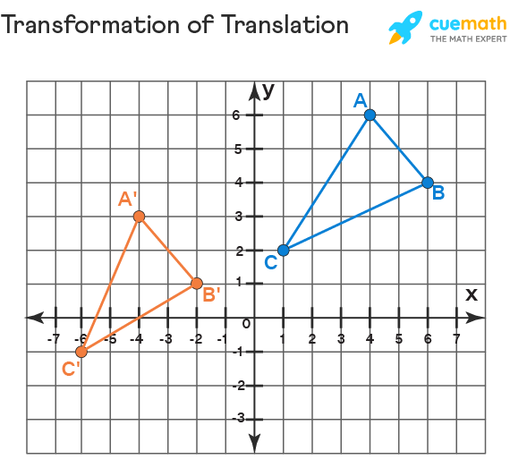

<h2 align=center>Week 02: <em>Day 1</em></h2>

<h1 align=center>You're getting old, Matrix</h1>

<h3 align=center>12 Horsebow Moon, Imperial Year MMXXIV</h3>

***Song of the day***: _[**Flavien Berger**](https://www.youtube.com/watch?v=Iyzv632Vyho) by  La Fête Noire(2018)._

---

### Sections

1. [**The XYZs of Animation**](#one)
2. [**Matrix Arithmetic**](#two)
    1. [**Scalar Multiplication**](#scalar-multiplication)
    2. [**Matrix Multiplication**](#matrix-multiplication)
3. [**Modeling Operations**](#three)
    1. [**Scaling**](#scaling)
    2. [**Rotation**](#rotation)
    3. [**Translation**](#translation)
4. [**Why Do We Use Homogeneous Coordinates?**](#four)
5. [**Matrices in OpenGL**](#five)

---

<a id="one"></a>

### Part 1: _The XYZs of Movement_

How do we simulate movement through space? Physics teaches to do so via methods called vectors, whereby each vector contains a X-, Y-, and Z-coordinate in [**cartesian space**](https://en.wikipedia.org/wiki/Cartesian_coordinate_system):


<sub>**Figure 1**: Illustration of a Cartesian coordinate plane. Four points are marked and labeled with their coordinates: (2, 3) in green, (−3, 1) in red, (−1.5, −2.5) in blue, and the origin (0, 0) in purple.</sub>

This makes sense—we exist as we know it in three-dimensional space, and as such it takes three values to determine a location in each of those three dimensions.

It will not surprise you to learn that modelling in video games works in exactly the same way. In just about every situation, we will be dealing with an initial set of coordinates, represented by an X-value, a Y-value, and a Z-value, and then some sort of **transformation** being done upon this set of coordinates. The resulting set of coordinates will then be displayed on our screen and appear to us as _movement_.

---

Naturally, there are ways with which OpenGL performs these operations, and they are based on the principles of **linear algebra** or, more specifically, on [**matrix**](https://en.wikipedia.org/wiki/Matrix_(mathematics)) operations:


<sub>**Figure 2**: An _m_ × _n_ matrix. The _m_ rows are horizontal and the _n_ columns are vertical. Each element of a matrix is often denoted by a variable with two subscripts. For example, a<sub>2,1</sub> represents the element at the second row and first column of the matrix.</sub>

<br>

<a id="two"></a>

### Part 2: _Matrix Arithmetic_

Before we move, it may be necessary to brush up on some linear algebra—specifically, on matrix operations.

#### **Scalar Multiplication**

This one is easy. A **scalar** value is any value that has a magnitude but not a physical direction. Examples of these are temperature, ages, and mass. Vectors, by definition, have a physical direction, but because our second operand is a scalar, we don't have to worry about changing it. We simply multiply all of the values inside the matrix by that scalar value to get our result. For example:


<sub>**Figure 3**: The matrix (1, 2, 3) being multiplied by the scalar value 4.</sub>

#### **Matrix Multiplication**

Matrix multiplication has some interesting rules that we need to be aware of. Namely:



<sub>**Figure 4**: Matrix multiplication rules ([**source**](https://www.cuemath.com/algebra/multiplication-of-matrices/)).</sub>

Essentially, the number of columns in matrix A _must_ be equal to the number of rows in matrix B. For example, multiplying a 4 × 3 matrix by a 3 × 4 matrix is valid and it gives a matrix of order 4 × 4, whereas multiplication of a 4 × 3 matrix and 2 × 3 matrix would not be possible. Here's a sample animation of how it works:



In other words, we take the transpose of the second matrix, multiply and add elements together to get the result. 

<sub>**Figure 5**: Visualisation of matrix multiplication ([**source**](https://towardsdatascience.com/matrix-multiplication-part2-lesson8-34c9b77855c4)).</sub>

Taking the 15 in location (1, 1) of the the resulting matrix as an example, we:

1. Perform 1 (**A**<sub>1, 1</sub>) * 2 (**B**<sup>T</sup><sub>2, 1</sub>) = 2
2. Perform 2 (**A**<sub>1, 2</sub>) * 6 (**B**<sup>T</sup><sub>2, 2</sub>) = 12
3. Perform 1 (**A**<sub>1, 3</sub>) * 1 (**B**<sup>T</sup><sub>2, 3</sub>) = 1 
4. Add them all together to get 2 + 12 + 1 = **15**
5. Locate 16 in location (1, 1) of the resulting matrix.

<br>

<a id="three"></a>

### Part 3: _Modeling Operations_

Why do we need matrices, of all things? It turns out that both their representative and operative abilities—that is, what they can represent and how they can interact with each other—is an accurate and elegant way of representing transformations on objects.

#### **Scaling**

For example, consider the top of a pyramid that is, say, 100 metres tall. Using cartesian coordinates, we might represent its apex as point (0, 0, 100.0)—that is, it shoots straight upwards 100 metres in the air, but does not move away from the origin in neither the x- nor the y-directions. The matrix equivalent of this cartesian notation is a **vector**, and looks something like this:


<sub>**Figure 6**: A 1 × 3 matrix, or a _vector_, representing the cartesian point (0.0, 0.0, 100.0).</sub>

Why is this helpful? Let's say we wanted to make our pyramid twice as big. This would mean that its highest point—its apex—would no longer rest at point (0.0, 0.0, 100.0), but rather at point (0.0, 0.0, 200.0). This is known as **scaling**, and is the simplest of the three main transformations that we will learn how to do in this course. This is because, if you have a matrix indicating a point in space, and you want to scale it, all you have to do is multiply each of its coordinate values by that scalar value (e.g. 2). Let's look at the other two.


<sub>**Figure 7**: An example of scalar multiplication.</sub>

#### **Rotation**

Here's where matrices really come in handy. Scaling things is easy because you are multiplying a vector (something with both a magnitude and a direction) by a **scalar value** (something that only has a magnitude). But what happens when you want to operate on a vector in a certain direction?

The act of rotation—moving a certain object around a given axis—is, by definition, a directed operation, so multiplying by a scalar won't do. For this, we need a special matrix:


<sub>**Figure 8**: The [**rotation matrix**](https://en.wikipedia.org/wiki/Rotation_matrix), _R_.</sub>

Here, our angle, _θ_, is the angle at which our model is being rotated in respect to the positive x-axis about the origin of a two-dimensional Cartesian coordinate system (that nightmare of a sentence will make a lot more sense once we get to programming lol). Performing a general multiplication using this matrix, we would get something like:


<sub>**Figure 9**: A column vector **v** being multiplied by the rotation matrix ***R***.</sub>

And it's basically the same for every 2-dimensional column vector. Say we had a point in location (0, 5), and we wanted to rotate it 45 degrees:


<sub>**Figure 10**: An example of rotating a point.</sub>

#### **Translation**

Translation is essentially moving our points in any of the 3 cardinal directions.



<sub>**Figure 11**: An example of a triangle being translated along a 2-dimensional cartesian plane.</sub>

Translations, programming-wise, are similar in "complexity" to rotations, i.e., we are multiplying a matrix by another matrix. Visualising the actual operation, though requires a little bit of change of gears. In order to perform a translation on a column vector containing an x-, y-, and z-coordinate, we need to use something called [**homogeneous coordinates**](https://en.wikipedia.org/wiki/Homogeneous_coordinates).

Without getting too much into the history of homogeneous coordinates, for our purposes, using them involves simply adding an extra row in our column vector containing a 1:


<sub>**Figure 12**: A 2-dimensional column vector using homogeneous coordinates.</sub>

Why we end up needing this becomes clear when we look at the translation matrix that we will be using:


<sub>**Figure 12**: Transformation matrix used for translating in the x and y directions.</sub>

Let's see an example in action. If we have a point, say (4, -2), and we want to translate it two units up and one unit to the right:


<sub>**Figure 13**: A column vector being transformed 2 units up and one unit to the right.</sub>

Makes sense, I hope. [**Here's**](https://matrix.reshish.com/multiplication.php) a handy matrix multiplication online tool that you may use when you want to make some quick calculations when working on your games!

<br>

<a id="four"></a>

### Part 4: _Why Do We Use Homogeneous Coordinates?_

#### Cartesian Coordinates
In 2D Cartesian coordinates, a point is represented as \((x, y)\). Transformations like rotation and scaling can be represented using 2x2 matrices. However, translation does not fit into a 2x2 matrix format.

**Scaling**:

```
[ sx  0 ]   *   [ x ]   =   [ sx * x ]
[  0 sy ]       [ y ]       [ sy * y ]
```

**Rotation**:

```
[ cosθ -sinθ ]   *   [ x ]   =   [ x' ]
[ sinθ  cosθ ]       [ y ]       [ y' ]
```

**Translation**: Translation cannot be represented directly with a 2x2 matrix.
```
[ x ]   +   [ tx ]   =   [ x + tx ]
[ y ]       [ ty ]       [ y + ty ]
```

#### Homogeneous Coordinates
To unify these transformations into a single matrix format, we use homogeneous coordinates. In 2D, a point \((x, y)\) is represented as \((x, y, 1)\).

1. **Translation**: In homogeneous coordinates, we can represent translation using a 3x3 matrix.

    ```
    Translation Matrix:
    [ 1   0   tx ]
    [ 0   1   ty ]
    [ 0   0   1  ]
    ```

    Applying this to a point \((x, y, 1)\):

    ```
    [ 1   0   tx ]       [ x ]       [ x + tx ]
    [ 0   1   ty ]   *   [ y ]   =   [ y + ty ]
    [ 0   0   1  ]       [ 1 ]       [   1    ]
    ```

    This moves the point \((x, y)\) by \((tx, ty)\).

2. **Scaling**: In homogeneous coordinates, scaling is represented as:

    ```
    Scaling Matrix:
    [ sx   0   0 ]
    [  0  sy   0 ]
    [  0   0   1 ]
    ```

    Applying this to a point \((x, y, 1)\):

    ```
    [ sx   0   0 ]   [ x ]   [ sx * x ]
    [  0  sy   0 ] * [ y ] = [ sy * y ]
    [  0   0   1 ]   [ 1 ]   [   1    ]
    ```

3. **Rotation**: In homogeneous coordinates, rotation is represented as:

    ```
    Rotation Matrix:
    [ cosθ  -sinθ   0 ]
    [ sinθ   cosθ   0 ]
    [  0      0     1 ]
    ```

    Applying this to a point \((x, y, 1)\):

    ```
    [ cosθ  -sinθ   0 ]   [ x ]   [ x' ]
    [ sinθ   cosθ   0 ] * [ y ] = [ y' ]
    [  0      0     1 ]   [ 1 ]   [ 1  ]
    ```

#### Combining Transformations

One of the biggest advantages of using homogeneous coordinates is that we can combine multiple transformations into a single matrix. For example, if we want to scale, then rotate, and finally translate a point, we can multiply the respective matrices together and apply the resulting matrix to the point.

```
Combined Matrix = Translation * Rotation * Scaling
```

In homogeneous coordinates, all transformations (translation, scaling, rotation) are represented using 3x3 matrices, allowing us to easily combine them into a single transformation matrix.

Essentially, homogeneous coordinates simplify the representation and combination of various transformations. By adding an extra coordinate, we can use matrix multiplication for all transformations, making the math consistent and straightforward. This unification is particularly powerful in computer graphics, where we frequently need to apply multiple transformations to objects.

<br>

<a id="five"></a>

### Part 5: _Matrices in OpenGL_

Let's take a look at some of our code from last week and see if we can find some examples of what we've been looking at.

In our `initialise()` function, we initialised our view, model, and projection matrices using our OpenGL/SDL libraries:

```c++
view_matrix = glm::mat4(1.0f);  // Defines the position of the camera
model_matrix = glm::mat4(1.0f);  // Defines every transformation applied to an object
projection_matrix = glm::ortho(-5.0f, 5.0f, -3.75f, 3.75f, -1.0f, 1.0f);  // Defines the characteristics of your camera.
```

With our newfound (or rekindled) linear algebra knowledge, let's take a look at what each of their initial values actually mean. Both `view_matrix` and `model_matrix` are initialised to the same value: `glm::mat4(1.0f)`. What might this mean? If we take each element from left to right:

- **`glm::`**: This signifies that we are "extracting" something from the `glm` namespace (just like how we get `cout` from the `std` namespace).
- **`mat4`**: The is the name of the class of the object we are instantiating. As you probably guessed, this is just short of a 4 × 4 matrix.
- **`(1.0f)`**: A 4 × 4 contains 16 elements within it, so how are we initialising it with only one? The creators of these libraries did us a huge solid here by allowing us to initialise simple matrices if we don't need specific control over each of the _n_ × _n_ elements of a matrix. In this case, passing a `1.0f` into `mat4`'s constructor results in the creation of a 4 × 4 [**identity, or unit, matrix**](https://en.wikipedia.org/wiki/Identity_matrix) (_I_):


<sub>**Figure 14**: 2 × 2 and a 3 × 3 identity matrices.</sub>

We actually saw a modified identity matrix earlier (figure 12 and 13) when translating, and we'll continue seeing them throughout the course. I wouldn't worry too much about `ortho`, since our viewpoints won't be doing too much yet, but here's a [**great**](https://www.scratchapixel.com/lessons/3d-basic-rendering/perspective-and-orthographic-projection-matrix/orthographic-projection-matrix) article that describes just what it does, in case you're curious.

---

And that's really kind of it for now. Just to give you a taste of what we'll be looking at next week, I will be making our triangle scale up _ad infinitum_.

The function to scale in OpenGL also resides in the `glm` namespace, and it is called `scale`:

```c++
new_matrix = glm::scale(original_matrix, scale_vector);
```

<sub>**Code Block 1**: The syntax of a scaling call.</sub>

Here, both `original_matrix` and `new_matrix` are matrix objects of order _n_ × _n_. `scale_vector` is an _n - 1_ × _n - 1_ `vec` object. Since basically all of the matrices that we will deal with in this class will be on the order of 4 × 4 or higher, we will be using a `vec3` object to define our scaling in the x-, y-, and z-direction. Let's see what we would do in the case of our triangle:

```c++
void update() 
{
    // This scale vector will make the x- and y-coordinates of the triangle
    // grow by a factor of 1% of it of its original size every frame.
    float g_scale_factor = 1.01;
    glm::vec3 g_scale_vector = glm::vec3(scale_factor, scale_factor, 1.0f);
    
    // We replace the previous value of the model matrix with the scaled
    // value of model matrix. This would mean that  glm::scale() returns
    // a matrix, which it does!
    g_model_matrix = glm::scale(g_model_matrix, scale_vector);
}
```

<sub>**Code Block 2**: Scaling the size of our model matrix by 1% every frame.</sub>

<p align=center>
    </img>
</p>

<sub>**Figure 15**: The result of code block 2.</sub>

You can find the completed `main.cpp` file [**here**](SDLProject/main.cpp).