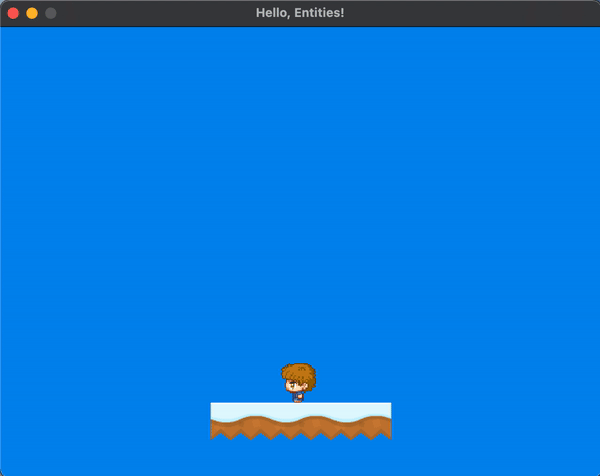
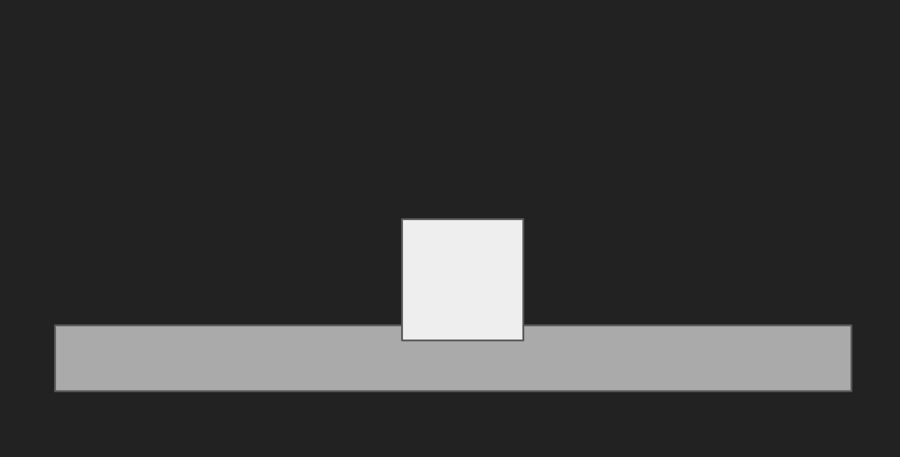
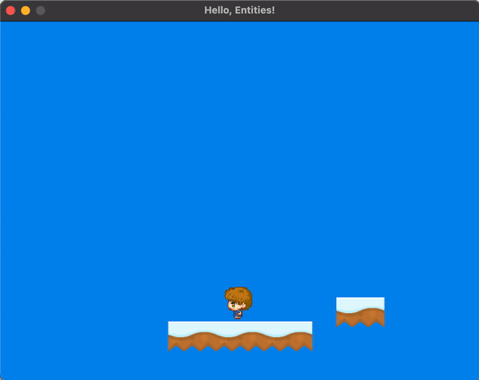
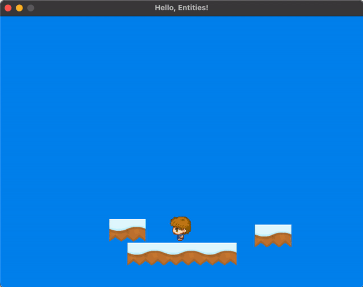
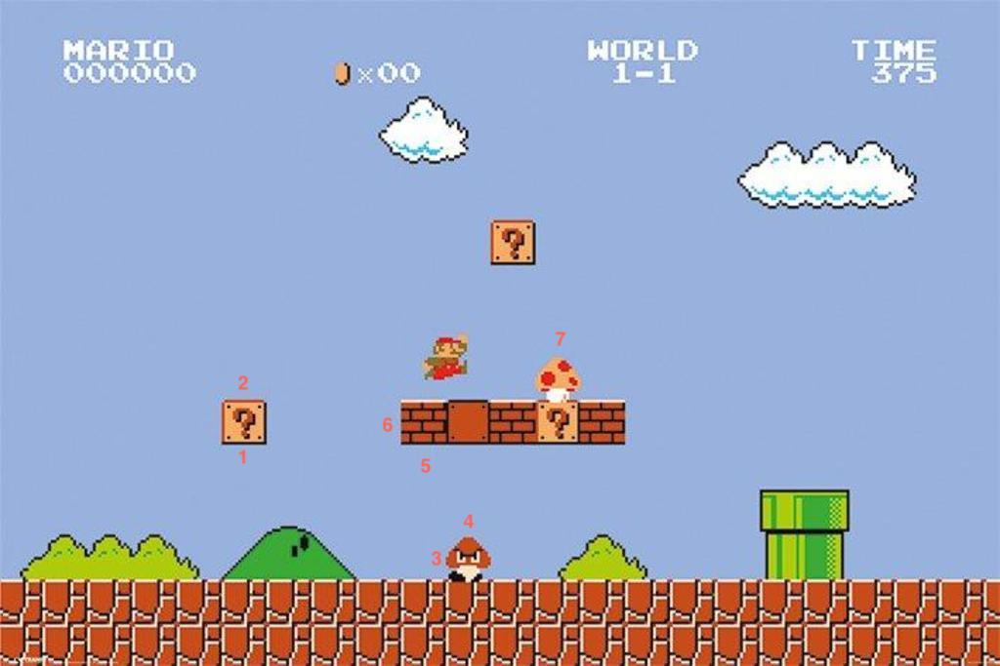
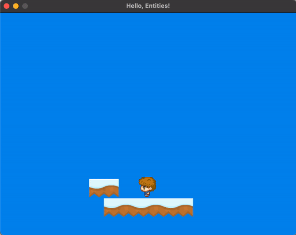

<h2 align=center>Week 6</h2>

<h1 align=center>Colliding with Different Kinds of Entities</h1>

<h3 align=center>11 Wyvern Moon, Imperial Year MMXXIV</h3>

<p align=center><strong><em>Song of the day</strong>: <a href="https://www.youtube.com/watch?v=rZxCk39NXxU"><strong><u>Drunk</u></strong></a> by Dijon (2019).</em></p>

### Sections

---

1. [**Collision Overlap**](#1)
2. [**It's-a me, Jumping**](#2)
3. [**`is_active`, Collision Flags, and Entity Types**](#3)
    1. [**`is_active`**](#3-1)
    2. [**Collision Flags**](#3-2)
    3. [**Entity Types**](#3-3)

---

<a id="1"></a>

### Part 1: _Collision Overlap_

Last time, we ran into a bit of a problem. When landing on a platform, we instructed OpenGL to skip the section in the `update()` method that handles movement. This makes sense; we don't want our character to continue moving through the platform. This, though, restricts movement in _all_ directions, rendering our character essentially static:



```c++
for (int i = 0; i < collidable_entity_count; i++)
{
    if (check_collision(&collidable_entities[i])) return;
}
```

<sub>**Figure 1 and Code Block 1**: Not the best way to platform if you can't move.</sub>

The fix for this not only allows for horizontal movement, but also fixes another one of our problems. Occasionally, we'll find ourselves in the situation where our player clips into another object, effectively trapping themselves an in eternal collision:



<sub>**Figure 2**: The character (above) will register a collision every frame, since we are _inside_ of the platform.</sub>

So, in order to fix this, we have to nudge our character up the exact amount that we clip into the other entity **before attempting to move**. The code for this is as follows:


```c++
void Entity::update(float delta_time, Entity *collidable_entities, int collidable_entity_count)
{
    // Some code...

    for (int i = 0; i < collidable_entity_count; i++)
    {
        // STEP 1: For every entity that our player can collide with...
        Entity *collidable_entity = &collidable_entities[i];
        
        if (check_collision(collidable_entity))
        {
            // STEP 2: Calculate the distance between its centre and our centre
            //         and use that to calculate the amount of overlap between
            //         both bodies.
            float y_distance = fabs(m_position.y - collidable_entity->m_position.y);
            float y_overlap = fabs(y_distance - (m_height / 2.0f) - (collidable_entity->m_height / 2.0f));
            
            // STEP 3: "Unclip" ourselves from the other entity, and zero our
            //         vertical velocity.
            if (m_velocity.y > 0) {
                m_position.y   -= y_overlap;
                m_velocity.y    = 0;
            } else if (m_velocity.y < 0) {
                m_position.y      += y_overlap;
                m_velocity.y       = 0;
            }
        }
    }

    // Move
}
```

<sub>**Code Block 2**: Ensuring that we don't eternally collide with the floor, allowing us horizontal movement.</sub>

The result is the beginnings of a platformer game:


<sub>**Figure 3**: George takes a walk.</sub>

<br>

<a id="2"></a>

### Part 2: _It's-a me, Jumping_

And what kind of platformer would we have if we couldn't jump onto another platform? Let's add our very first physics-based mechanic.

How we will determine whether the player is jumping or not is through a boolean flag, which we will add to our `Entity` class. Additionally, we also need to specify with which button we will jump, and with how much **force** our player is going to jump. Remember—all of these things are physics-based:

```c++
// Entity.h
class Entity
{
private:
    bool  m_is_jumping;
    float m_jumping_power;

public:
    void const jump() { m_is_jumping = true; }
}
```
```c++
void process_input()
{
    SDL_Event event;
    while (SDL_PollEvent(&event))
    {
        switch (event.type) {
            case SDL_KEYDOWN:
                switch (event.key.keysym.sym) {
                    case SDLK_SPACE:
                        // Jump
                        state.player->jump();
                        break;
                        
                    default:
                        break;
                }
                
            default:
                break;
        }
    }
}
```
```c++
// Entity.cpp
void Entity::update(float delta_time, Entity *collidable_entities, int collidable_entity_count)
{
    // ––––– JUMPING ––––– //
    if (m_is_jumping)
    {
        // STEP 1: Immediately return the flag to its original false state
        m_is_jumping = false;
        
        // STEP 2: The player now acquires an upward velocity
        m_velocity.y += m_jumping_power;
    }
}
```

<sub>**Code Blocks 3, 4, and 5**: Adding jumping functionality to our game by updating our `Entity` class, its `update()` method, and the game's `process_input()` function.</sub>

The result is a very cute jumping George. But there's one problem...


<sub>**Figure 4**: Jump, double jump, triple jump, quadruple jump, etc..</sub>

We'll fix that in time. For now, let's give George a platform to jump into:



<sub>**Figure 5**: Technically a game. Geronimo!</sub>

But what happens if we try to create a sort of staircase, and have George walk into it?


<sub>**Figure 6**: Wait, no. Don't...don't do that.</sub>

We need to make some changes to our collision detection, since we don't ever account for the possibility of horizontal collisions. We want to check for vertical collisions first, since that's the direction of our gravity, and then for any horizontal collisions. In short, we want something like this:

```c++
// Entity.cpp
void Entity::update(float delta_time, Entity *collidable_entities, int collidable_entity_count)
{
    m_velocity += m_acceleration * delta_time;

    m_position.y += m_velocity.y * delta_time;                              // move on Y
    check_collisions_y(collidable_entities, collidable_entity_count);   // fix if needed

    m_position.x += m_velocity.x * delta_time;                              // move on x
    check_collisions_x(collidable_entities, collidable_entity_count);   // fix if needed
}

void const Entity::check_collision_y(Entity *collidable_entities, int collidable_entity_count)
{
    for (int i = 0; i < collidable_entity_count; i++)
    {
        // STEP 1: For every entity that our player can collide with...
        Entity *collidable_entity = &collidable_entities[i];
        
        if (check_collision(collidable_entity))
        {
            // STEP 2: Calculate the distance between its centre and our centre
            //         and use that to calculate the amount of overlap between
            //         both bodies.
            float y_distance = fabs(m_position.y - collidable_entity->m_position.y);
            float y_overlap = fabs(y_distance - (m_height / 2.0f) - (collidable_entity->m_height / 2.0f));
            
            // STEP 3: "Unclip" ourselves from the other entity, and zero our
            //         vertical velocity.
            if (m_velocity.y > 0) {
                m_position.y   -= y_overlap;
                m_velocity.y    = 0;
            } else if (m_velocity.y < 0) {
                m_position.y      += y_overlap;
                m_velocity.y       = 0;
            }
        }
    }
}

void const Entity::check_collision_x(Entity *collidable_entities, int collidable_entity_count)
{
    for (int i = 0; i < collidable_entity_count; i++)
    {
        Entity *collidable_entity = &collidable_entities[i];
        
        if (check_collision(collidable_entity))
        {
            float x_distance = fabs(m_position.x - collidable_entity->m_position.x);
            float x_overlap = fabs(x_distance - (m_width / 2.0f) - (collidable_entity->m_width / 2.0f));
            if (m_velocity.x > 0) {
                m_position.x     -= x_overlap;
                m_velocity.x      = 0;
            } else if (m_velocity.x < 0) {
                m_position.x    += x_overlap;
                m_velocity.x     = 0;
            }
        }
    }
}
```



<sub>**Code Block 6 and Figure 7**: Much better.</sub>

<br>

<a id="3"></a>

### Part 3: _`is_active`, Collision Flags, and Entity Types_

As the complexity of our games grows, you'll likely start to notice that one function, method, and/or class will not be enough for us to be able to give unique functionality to our player, our enemies, and the world which they in habit. Collision detection, for example, should exhibit different behaviour depending on whether we touch an enemy or a wall. In the case of, say, Super Mario Bros., we have several types of collisions depending on not just the object, but on the direction that we are colliding with said object:



<sub>**Figure 8**: Even within this frame alone, we have multiple types of collisions depending on what and in which direction Mario hits them in. `1` will release the contents of the ? block, `2` will have the ? block be a simple platform, `3` will cause Mario to take damage, `4` will cause the enemy to take damage, `5` will destroy the brick block, `6` will be a simple collision, and `7` will give Mario a power-up.</sub>

The way we deal with all of these different types of situations is by adding a few flags to our entity classes. Let's start with a simple one.

<a id="3-1"></a>

#### `is_active`

The `is_active` flag will have the simple job of telling OpenGL whether that specific `Entity` object is currently active in the scene. For example, when Mario hits a coin, the coin should disappear. This is a handy way of handling objects because it saves us the trouble of having to allocate and deallocate memory every time something happens to them—we can simply turn a simple flag off to turn all interactions off:

```c++
class Entity
{
public:
    
    bool m_is_active;
}

void Entity::update(float delta_time, Entity *collidable_entities, int collidable_entity_count)
{
    if (!m_is_active) return;

    // The rest of the method...
}

void Entity::render(ShaderProgram *program)
{
    if (!m_is_active) return;

    // The rest of the method...
}

bool const Entity::check_collision(Entity *other) const
{
    // If either entity is inactive, there shouldn't be any collision
    if (!m_is_active || !other->m_is_active) return false;

    // The rest of the method
}
```

<sub>**Code Block 7**: Before we even do anything with an entity, we want to make sure that it's even active.</sub>

Let's turn off one of the platforms in `initialise()` for demonstration purposes:

```c++
void initialise()
{
    state.platforms[PLATFORM_COUNT - 2].m_texture_id = platform_texture_id;
    state.platforms[PLATFORM_COUNT - 2].set_position(glm::vec3(2.5f, -2.5f, 0.0f));
    state.platforms[PLATFORM_COUNT - 2].set_width(0.4f);
    state.platforms[PLATFORM_COUNT - 2].update(0.0f, NULL, 0);

    state.platforms[PLATFORM_COUNT - 2].m_is_active = false;
}
```


<sub>**Code Block 8 and Figure 9**: Our right platform may as well not exist, even though it is actually there.</sub>

---

<a id="3-2"></a>

#### Collision Flags

Our next step is to add a collision flag for every direction that our entities can be hit from. This is where having square-shaped entities comes in **really** handy; we only have to worry about the four cardinal directions:

```c++
class Entity
{
public:
    // Colliding
    bool m_collided_top    = false;
    bool m_collided_bottom = false;
    bool m_collided_left   = false;
    bool m_collided_right  = false;
}
```

Now, at the beginning of every frame, we need to make sure all of these flags are set to `false` the reason for this is that we only want these to be `true` **if and when a collision is detected**:

```c++
void Entity::update(float delta_time, Entity *collidable_entities, int collidable_entity_count)
{
    m_collided_top    = false;
    m_collided_bottom = false;
    m_collided_left   = false;
    m_collided_right  = false;
}

void const Entity::check_collision_y(Entity *collidable_entities, int collidable_entity_count)
{
    for (int i = 0; i < collidable_entity_count; i++)
    {
        Entity *collidable_entity = &collidable_entities[i];
        
        if (check_collision(collidable_entity))
        {
            float y_distance = fabs(position.y - collidable_entity->position.y);
            float y_overlap = fabs(y_distance - (height / 2.0f) - (collidable_entity->height / 2.0f));
            if (velocity.y > 0) {
                position.y   -= y_overlap;
                velocity.y    = 0;

                // Collision!
                collided_top  = true;
            } else if (velocity.y < 0) {
                position.y      += y_overlap;
                velocity.y       = 0;

                // Collision!
                collided_bottom  = true;
            }
        }
    }
}

void const Entity::check_collision_x(Entity *collidable_entities, int collidable_entity_count)
{
    for (int i = 0; i < collidable_entity_count; i++)
    {
        Entity *collidable_entity = &collidable_entities[i];
        
        if (check_collision(collidable_entity))
        {
            float x_distance = fabs(position.x - collidable_entity->position.x);
            float x_overlap = fabs(x_distance - (width / 2.0f) - (collidable_entity->width / 2.0f));
            if (velocity.x > 0) {
                position.x     -= x_overlap;
                velocity.x      = 0;

                // Collision!
                collided_right  = true;
            } else if (velocity.x < 0) {
                position.x    += x_overlap;
                velocity.x     = 0;
 
                // Collision!
                collided_left  = true;
            }
        }
    }
}
```

<sub>**Code Block 9**: Recording _specific_ types of collisions.</sub>

The cool thing about this that this allows us to fix our infinite jump problem almost trivially. Essentially, we only want to allow the player the ability to jump _if_ they are touching a platform i.e. if `collided_bottom` equals `true`:

```c++
void process_input()
{
    SDL_Event event;
    while (SDL_PollEvent(&event))
    {
        switch (event.type) {
            case SDL_KEYDOWN:
                switch (event.key.keysym.sym) {
                    case SDLK_SPACE:
                        // Jump only if we are colliding with a platform in a specific way
                        if (g_game_state.player->get_collided_bottom()) 
                            g_game_state.player->jump();
                        break;
                        
                    default:
                        break;
                }
                
            default:
                break;
        }
    }
}
```

<sub>**Code Block 10**: A more specific condition for jumping.</sub>

<a id="3-3"></a>

#### Entity Types

One last concept you could start thinking about is assigning different "types" to entities. For example, we only want to jump when we are touching a platform from above, right? But what if we are touching an enemy from above, or an item? Our current system checks for _any_ type of vertical collision. Giving can allow for more finessed checking:

```c++
enum EntityType { PLATFORM, PLAYER, ITEM };

class Entity 
{
public:
    EntityType type;
}
```