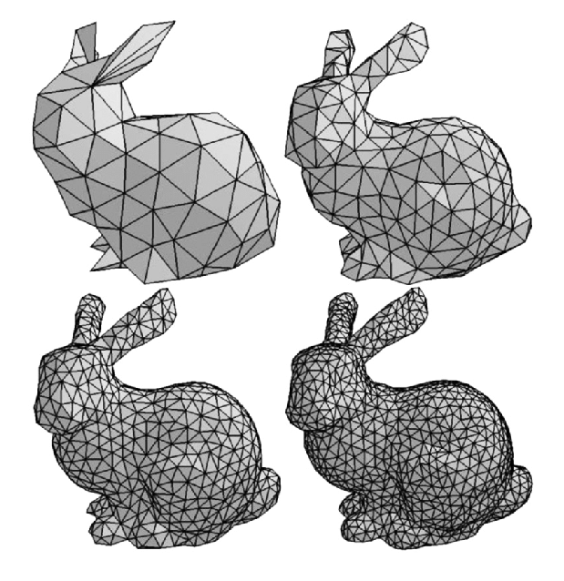
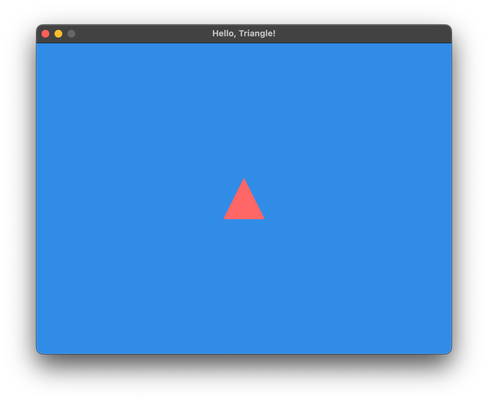

<h2 align=center>Lecture 01: <em>Part 2</em></h2>

<h1 align=center>Triangles</h1>

<h3 align=center>26 Guardian Moon, Imperial Year MMXXIV</h3>

***Song of the day***: _[**ELECTRONIC FREEEEE!!!**](https://youtu.be/gSMcTyyH90Q?si=Dycy5i4nBpAX1ur2) by Mashinomi (feat. Pasocom Music Club)._

### Sections

1. [**Of Graphics and Hardware**](#part-1-of-graphics-and-hardware)
2. [**Hello Triangle!**](#part-1-hello-triangle)
3. [**The game loop**](#part-2-the-game-loop)
4. [**Initialising our triangle program**](#part-3-initialising-our-triangle-program)
 
### Part 1: _Of Graphics and Hardware_

How do graphics get created and rendered onto our screens?

Back in the old days of the Atari 2600, this was literally done by telling the console's microprocessor when, where, and what kind of colours could be rendered on the screen. For example, the following frame was drawn by the Atari 2600:


<sub>**Figure 1**: A very cute Atari rainbow.</sub>

This visible colour part is what is called the `ACTUAL TV PICTURE` in figure 2:


<sub>**Figure 2**: [**TIA**](https://en.wikipedia.org/wiki/Television_Interface_Adaptor) TV Diagram.</sub>

As you can see, the visible part of the game is only really a small chunk of what the hardware was actually rendering. You can see this if you take a look at the 6502 assembly code that actually generates that rainbow:

```asm
NextFrame:
    ; TURN ON VSYNC AND VBLANK
    LDA #2
    STA VBLANK                  ; turn on VBLANK
    STA VSYNC                   ; turn on VSYNC

    ; GENERATE 3 LINES OF VSYNC
    STA WSYNC                   ; first scanline
    STA WSYNC                   ; second scanline
    STA WSYNC                   ; third scanline

    LDA #0
    STA VSYNC                   ; turn off VSYNC

    ; GENERATE RECOMMENDED 37 LINES OF VBLANK
    LDX #37                     ; x = 37; counter for our loop
LoopVBlank:
    STA WSYNC                   ; hit WSYNC and wait for the next scanline
    DEX                         ; x--
    BNE LoopVBlank              ; loop while x != 0

    LDA #0
    STA VBLANK                  ; turn off VBLANK

    ; DRAW THE ACTUAL 192 SCANLINES
    LDX #192                    ; x = 192; counter for loop
LoopVisible:
    STX COLUBK                  ; set the background colour
    STA WSYNC                   ; wait for next scanline
    DEX                         ; x--
    BNE LoopVisible             ; loop while x != 0

    ; GENERATE 30 MORE VBLANK LINES ("overscan")
    LDA #2
    STA VBLANK                  ; hit VBLANK again

    LDX #30                     ; x = 30
LoopOverscan:
    STA WSYNC                   ; wait for next scanline
    DEX                         ; x--
    BNE LoopOverscan            ; loop while x != 0

    JMP NextFrame               ; start next frame
```

<sub>**Code Block A**: 6502 assembly code to generate figure 1.</sub>

So yeah, it's a good amount. The NES-era consoles were even more complicated. There, you not only had to deal with the scanlines, but also with moving sprites that acted independently to the background. I won't include the code here, but I did once give a lecture on how game development in assembly works, which you can find [**here**](https://github.com/sebastianromerocruz/game-programming-in-assembly/blob/main/LECTURE_NOTES.md). It's a lot of code for not much at all and, while it may be fun for some people, most modern game developers just want to get pixels on the screen with one or two lines of code.

---

So where are we now, and how does OpenGL fit into all of this? As you may already know, nowadays we have dedicated graphic cards installed into our machines. For those who actually care for that kind of stuff, owning the right graphics card is what makes all the difference in their gaming experience. And that's actually where libraries like OpenGL come in. OpenGL interacts directly with your graphics card to create high fidelity graphics with much smaller overhead than, say, Unity or even Unreal. This is why gaming companies create their own in-house engines. At a certain point, tools built by somebody else stop being enough, and we want to have as fine control of our game as possible.

### Part 2: _Hello, Triangle!_

So how are complex 3D models built using libraries like OpenGL? The answer is simple: triangles. Lots, and lots of triangles.



<sub>**Figure 3**: A [**model**](https://www.researchgate.net/figure/3D-mesh-triangles-with-different-resolution-3D-Modelling-for-programmers-Available-at_fig2_322096576) of a bunny at different resolutions.</sub>

I think, thus, that it's only fair that we start our OpenGL journey by making a super cool triangle. We'll start by importing all the stuff that we need from OpenGL. Some of it will look familiar from last time, but we have a couple of new things thrown in there:

```c++
// The old stuff
#define GL_SILENCE_DEPRECIATION
#define GL_GLEXT_PROTOTYPES 1

#ifdef _WINDOWS
#include <GL/glew.h>
#endif

#include <SDL.h>
#include <SDL_opengl.h>

// The new stuff
#include "glm/mat4x4.hpp"                // 4x4 Matrix
#include "glm/gtc/matrix_transform.hpp"  // Matrix transformation methods
#include "ShaderProgram.h"               // We'll talk about these later in the course
```

<sub>**Code Block 2**: Necessary imports and definitions to draw a single, 2D triangle with OpenGL.</sub>

It looks like we need a lot in order to just draw a triangle. Certainly, if you are coming from Python and are familiar with the [**`turtle`**](https://docs.python.org/3/library/turtle.html) module, it _is_ a lot more. But it will help us appreciate how much thought goes into making games as we go along the course.

Let's look at some of the constants that we will need for our triangle:

```c++
// Our window dimensions
const int WINDOW_WIDTH  = 640,
          WINDOW_HEIGHT = 480;

// Background color components
const float BG_RED     = 0.1922f, 
            BG_BLUE    = 0.549f,
            BG_GREEN   = 0.9059f,
            BG_OPACITY = 1.0f;

// Our viewport—or our "camera"'s—position and dimensions
const int VIEWPORT_X      = 0,
          VIEWPORT_Y      = 0,
          VIEWPORT_WIDTH  = WINDOW_WIDTH,
          VIEWPORT_HEIGHT = WINDOW_HEIGHT;

// Our shader filepaths; these are necessary for a number of things
// Not least, to actually draw our shapes 
// We'll have a whole lecture on these later
const char V_SHADER_PATH[] = "shaders/vertex.glsl";     // make sure not to use std::string objects for these!
const char F_SHADER_PATH[] = "shaders/fragment.glsl";
```

<sub>**Code Block 3**: The constants that we will need for our program.</sub>

And some of the global variables:

```c++
// Old stuff
SDL_Window* g_display_window;
bool g_game_is_running = true;

// New stuff
ShaderProgram g_program;

glm::mat4 g_view_matrix;        // Defines the position (location and orientation) of the camera
glm::mat4 g_model_matrix;       // Defines every translation, rotation, and/or scaling applied to an object; we'll look at these next week
glm::mat4 g_projection_matrix;  // Defines the characteristics of your camera, such as clip panes, field of view, projection method, etc.
```

<sub>**Code Block 4**: The variables that we will need for our program.</sub>

### Part 2: _The Game Loop_

Even if our program won't be actually acting like much of a game, we should always start with a game loop. It looks very similar to the one we did last class, but this time we are going to parcel out our functionality into different functions:

```c++
void initialise() { }
void process_input() { }
void update() { }
void render() { }

// The game will reside inside the main
int main(int argc, char* argv[])
{
    // Part 1: Initialise our program—whatever that means
    initialise();

    while (g_game_is_running)
    {
        // Part 2: If the player did anything—press a button, move the joystick—process it
        process_input();

        // Part 3: Using the game's previous state, and whatever new input we have, update the game's state
        update();

        // Part 4: Once updated, render those changes onto the screen
        render();
    }

    // Part 5: The game is over, so let's perform any shutdown protocols
    shutdown();
    return 0;
}
```

<sub>**Code Block 5**: Your average game driver code. All of our programs will more or less follow this structure.</sub>

Some of these functions are simple at this point. Since the user won't be doing anything besides ending the game (and thus, there won't be any updates to the state of our game), `process_input()`, `update()`, and `shutdown()` are basically the same as last class:

```c++
void process_input() 
{
    SDL_Event event;
    while (SDL_PollEvent(&event))
    {
        if (event.type == SDL_QUIT || event.type == SDL_WINDOWEVENT_CLOSE)
        {
            game_is_running = false;
        }
    }
}

void update() { /* No updates, so this stays empty! */ }

void shutdown() 
{
    SDL_Quit();
}
```

<sub>**Code Block 6**: Since our game is basically not a game yet, this is all that our input processing and updating does.</sub>

### Part 3: _Initialising Our Triangle Program_

Things get interesting when we get to initialising. In lecture 01, we initialised by telling OpenGL what colour we wanted our screen to be cleared to. We will be doing that again—but now, we will also be telling it about our triangle:

```c++
// Put these next to the rest of your constants
const float TRIANGLE_RED     = 1.0f,
            TRIANGLE_BLUE    = 0.4f,
            TRIANGLE_GREEN   = 0.4f,
            TRIANGLE_OPACITY = 1.0f;

void initialise()
{
    /* Old stuff */
    SDL_Init(SDL_INIT_VIDEO);
    g_display_window = SDL_CreateWindow("Hello, Triangle!",
                                      SDL_WINDOWPOS_CENTERED, SDL_WINDOWPOS_CENTERED,
                                      WINDOW_WIDTH, WINDOW_HEIGHT,
                                      SDL_WINDOW_OPENGL);
    SDL_GLContext context = SDL_GL_CreateContext(g_display_window);
    SDL_GL_MakeCurrent(g_display_window, context);

#ifdef _WINDOWS
    glewInit();
#endif

    /* New stuff */ 
    glViewport(VIEWPORT_X, VIEWPORT_Y, VIEWPORT_HEIGHT, VIEWPORT_HEIGHT);     // Initialise our camera
    g_program.load(V_SHADER_PATH, F_SHADER_PATH);                               // Load up our shaders

    // Initialise our view, model, and projection matrices
    g_view_matrix       = glm::mat4(1.0f);
    g_model_matrix      = glm::mat4(1.0f);
    g_projection_matrix = glm::ortho(-5.0f, 5.0f, -3.75f, 3.75f, -1.0f, 1.0f);  // Orthographic means perpendicular—meaning that our camera will be looking perpendicularly down to our triangle

    g_program.set_view_matrix(g_view_matrix);
    g_program.set_projection_matrix(g_projection_matrix);
    // Notice we haven't set our model matrix yet!

    g_program.set_colour(TRIANGLE_RED, TRIANGLE_BLUE, TRIANGLE_GREEN, TRIANGLE_OPACITY);
    glUseProgram(g_program.programID);

    // Old stuff
    glClearColor(BG_RED, BG_BLUE, BG_GREEN, BG_OPACITY);
}
```

In order, what we have done is:

1. Initialised our SDL display window and context, and made it current (in case we have several windows open)
2. Initialised our camera (viewport) using our pre-defined x- and y-positions, width, and height
3. Initialise our OpenGL program (the triangle):
    1. Load our vertex and fragment shaders
    2. Initialise our view, projection, and model matrices, and load the first two onto our program
    3. Set our model's (triangle's) colour
    4. Tell OpenGL to use it by passing in its ID
4. Setting the clear colour

### Part 4: _Rendering our triangle program_

There's a few things going on in the `render()` function:

```c++
void render() {
    // Step 1
    glClear(GL_COLOR_BUFFER_BIT);
    
    // Step 2
    g_program.SetModelMatrix(g_model_matrix);
    
    // Step 3
    float vertices[] =
    {
         0.5f, -0.5f,  // (x1, y1)
         0.0f,  0.5f,  // (x2, y2)
        -0.5f, -0.5f   // (x3, y3)
    };
    
    glVertexAttribPointer(g_program.positionAttribute, 2, GL_FLOAT, false, 0, vertices);
    glEnableVertexAttribArray(g_program.positionAttribute);
    glDrawArrays(GL_TRIANGLES, 0, 3);
    glDisableVertexAttribArray(g_program.positionAttribute);
    
    // Step 4
    SDL_GL_SwapWindow(g_display_window);
}
```

In order:

1. Clear the colour to our aforementioned initialisation settings
2. _Now_ we set our model matrix. The reason why we do this hear becomes clear if we think about what the model matrix does: it "defines every translation, rotation, and/or scaling applied to an object". This is essentially every environmental/physical change done onto an object _every frame_. For instance, if you kick a ball in-game, its change in location (translation) is applied _every frame_, not just in its initialisation.
3. Set up the triangle vertices and draw them using the following 4 commands.
4. Swap window basically means that whatever changes were rendered from the previous frame, swap them into the current frame.

The result, whose full code you can find [**here**](SDLProject/main.cpp), is your first step towards some serious game development–and make no mistake, it is a big one:



<sub>**Figure 4**: Hello, Triangle!</sub>